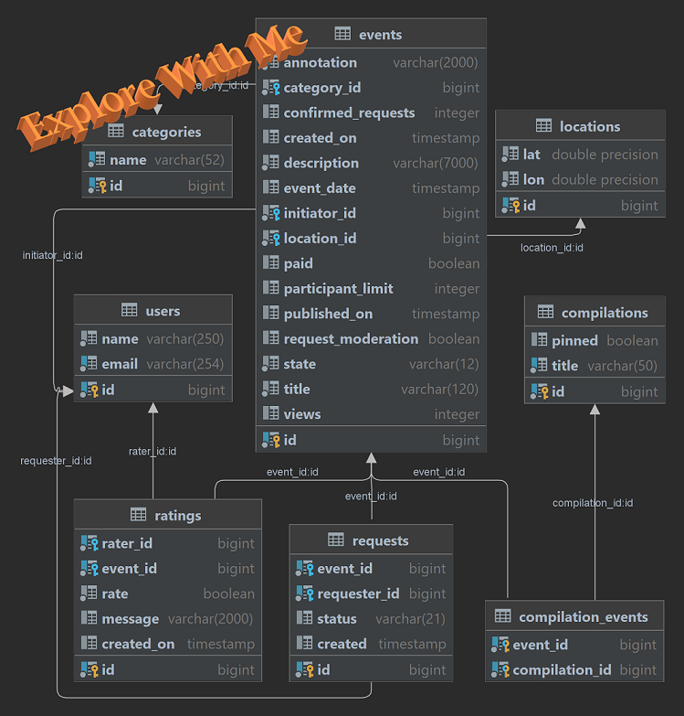

[Pull request](https://github.com/AleksandrKis/java-explore-with-me/pull/5)
# 

#### _backend project implementation_

## The project enables users to organize their leisure time by providing options to choose from existing events or create their own events.

### Application Features:

* #### Browse events created by other users or curated event collections by the administration.
* #### Create your own events with customizable payment rules, participation requirements, and participant limits.
* #### Rate and leave comments on events in which you have participated.
* #### Search for events based on specific criteria, including event ratings and ratings of event organizers.
* #### Track and analyze the number of unique IP views for each event, providing statistics on event views.

### **Technical features**:

* #### The application is primarily written in [Java](https://www.oracle.com/java/) ,utilizing [Maven](https://maven.apache.org/) as the build and dependency management system.
* #### The application is built using the [Microservices Architecture](http://microservices.io/) concept.
* #### It utilizes two [Spring Boot](https://spring.io/projects/spring-boot)-based services, with each service further divided into two microservices.
  #### The interaction between services is facilitated by the [RestTemplate](https://docs.spring.io/spring-framework/docs/current/javadoc-api/org/springframework/web/client/RestTemplate.html) component in Spring.
* #### The application, as well as each individual microservice, follows the [RESTful](https://www.tutorialspoint.com/restful/restful_introduction.htm) design principle, determining the architectural style.

  #### The services employ [Hibernate](https://hibernate.org/) for object-relational mapping with databases.
* #### Each service has its own microservice instance and a dedicated [PostgreSQL](https://www.postgresql.org/about/) database.
* #### The microservices are packaged into separate [Docker](https://www.docker.com/) containers, and the deployment automation and intercommunication
  #### are based on the utilization of docker-compose.yml.
* #### To deploy a project locally, you need a locally installed [Docker](https://www.docker.com/).
* #### Entity-Relationship Diagram of the database of the main service:

